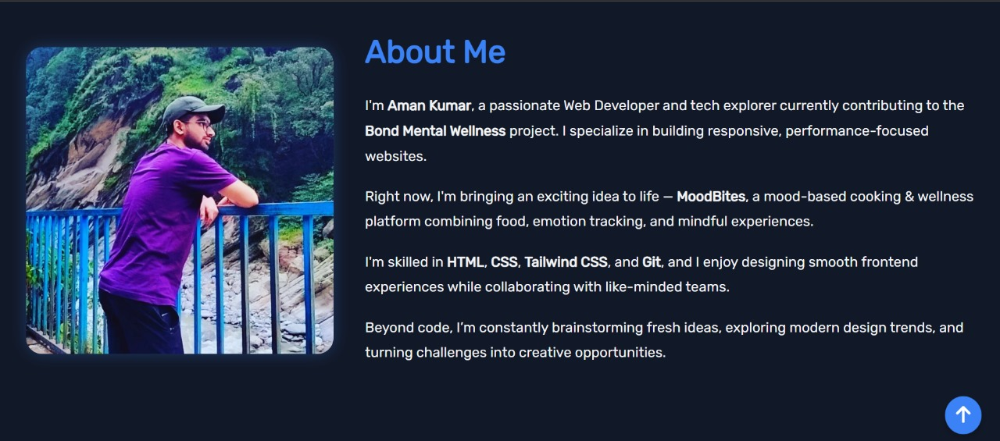

# Aman Kumar's Portfolio 🚀

Welcome to my **personal portfolio website**, crafted to showcase my web development journey, skills, and projects.

---

## 🧑‍💻 About Me

Hi! I'm **Aman Kumar**, a passionate and self-driven **Web & App Developer** and a **Tech Enthusiast**.  
Currently working on the **Bond Mental Wellness** project and building a mood-based food platform called **MoodBites**.

I specialize in responsive, clean, and performant web interfaces using:

- HTML & CSS
- Tailwind CSS
- JavaScript
- Git & GitHub

---

## 🌐 Live Website

🔗 [Visit My Portfolio](#)  
(Replace `#` with your portfolio URL once hosted)

---

## 📁 Features

- Hero section with animated buttons and intro
- Responsive **Education** & **Skills** sections
- Project showcase in a card layout (2x2 grid and single-column on mobile)
- Scroll-to-top button
- Footer with contact info and copyright

---

## 🛠 Tech Stack

- HTML
- CSS
- Tailwind CSS
- JavaScript

---

## 📸 Preview

Here’s a quick glimpse of the design:

  
(Replace this with an actual screenshot from your site)

---

### © Aman Kumar | 2025
